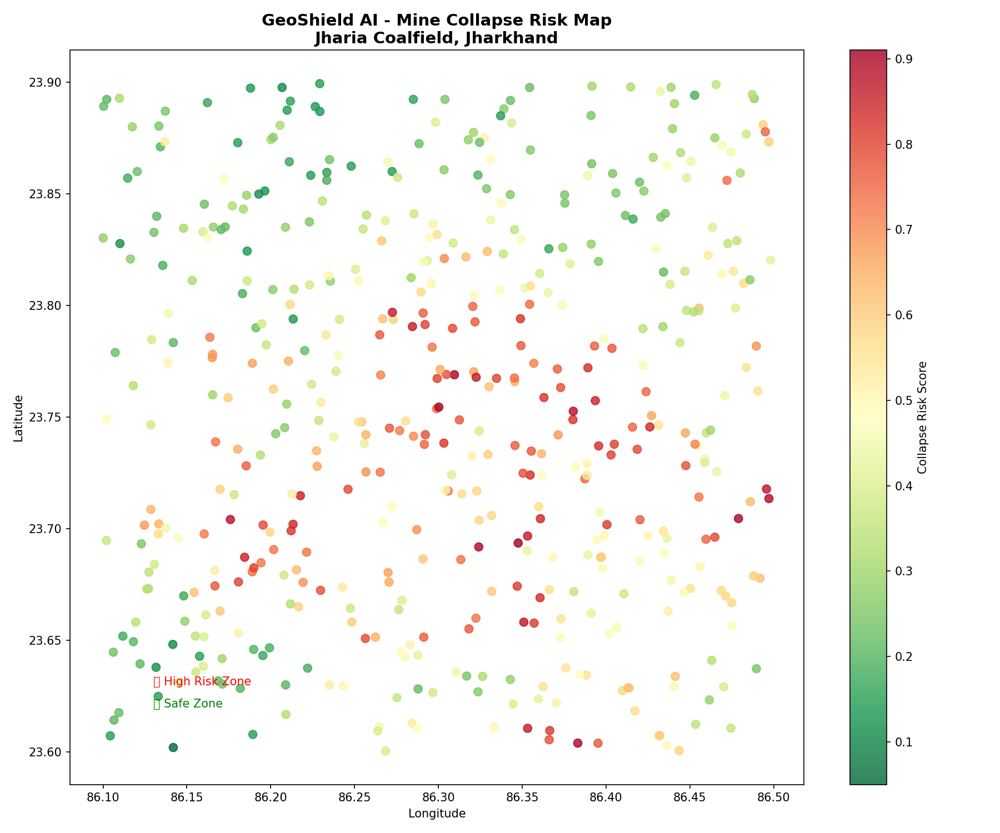

# 🛡️ GeoShield AI

### Satellite + Machine Learning Mine-Collapse Risk Mapping

GeoShield AI is a **research prototype** that combines satellite-derived environmental features with a Random Forest classifier to estimate **spatial mine-collapse risk** across the Jharia Coalfield, Jharkhand, India.

The current public V1 implementation processes data through **Google Earth Engine**, extracts four features, applies a pre-trained Random Forest model, and visualizes the resulting risk scores on an interactive map.

> **Important:** GeoShield V1 is a research/proof-of-concept system. Its risk scores are **not operational safety warnings** and should not be used on their own for evacuation, mine operations, or public-safety decisions.

---

## ✨ What it does

GeoShield V1:

1. Fetches satellite/environmental data from Google Earth Engine.
2. Calculates four model features:
   - NDVI change between 2017 and 2025
   - SRTM elevation
   - Cumulative ERA5-Land rainfall
   - Current NDVI (2025)
3. Samples locations across the Jharia Coalfield.
4. Uses a pre-trained **Random Forest Classifier** to produce a risk score from 0–1.
5. Displays the results on an interactive Folium map.
6. Shows risk distribution and model feature importance.
7. Allows high-risk locations to be exported as CSV.

---

## 🛰️ Data pipeline

```text
                 Google Earth Engine
                         │
          ┌──────────────┼──────────────┐
          │              │              │
     Sentinel-2       SRTM DEM      ERA5-Land
          │              │              │
     NDVI 2017       Elevation       Rainfall
          │              │              │
          └─────── Feature Engineering ───────┐
                                              │
                                      4 Model Features
                                              │
                                              ▼
                                  Random Forest Classifier
                                              │
                                              ▼
                                     Risk Score (0–1)
                                              │
                                              ▼
                                  Interactive Risk Map
                                              │
                                  ┌───────────┴───────────┐
                                  ▼                       ▼
                            Risk Analysis            CSV Export
```

---

## 🧠 Model

The current V1 model is a **Random Forest Classifier with 100 trees**, trained on 20 labeled Jharia locations:

- 10 known collapse/subsidence locations
- 10 safe locations
- 4 input features
- Output: model probability for the high-risk class

### Features

| Feature | Source | Meaning |
|---|---|---|
| `ndvi_change` | Sentinel-2 | Long-term vegetation change |
| `elevation` | SRTM DEM | Terrain elevation |
| `rainfall` | ERA5-Land | Cumulative rainfall |
| `ndvi_2025` | Sentinel-2 | Current vegetation condition |

The model file is included at:

```text
models/geoshield_model.pkl
```

---

## 🗺️ Example output



The map visualizes model-generated spatial risk scores for sampled locations across the Jharia Coalfield.

---

## 🛠️ Tech stack

**Language**
- Python 3.11

**Machine Learning**
- Scikit-learn
- Random Forest

**Geospatial / Earth Observation**
- Google Earth Engine
- Sentinel-2
- SRTM DEM
- ERA5-Land
- GeoPandas / Rasterio for geospatial workflows where applicable

**Visualization / App**
- Streamlit
- Folium
- streamlit-folium
- Matplotlib

**Data**
- NumPy
- Pandas

---

## 🚀 Run locally

### 1. Clone the repository

```bash
git clone https://github.com/<YOUR_USERNAME>/GeoShield-AI.git
cd GeoShield-AI
```

### 2. Create a virtual environment

```bash
python -m venv .venv
```

Activate it:

**macOS / Linux**
```bash
source .venv/bin/activate
```

**Windows**
```powershell
.venv\Scripts\activate
```

### 3. Install dependencies

```bash
pip install -r requirements.txt
```

### 4. Authenticate Google Earth Engine

```bash
earthengine authenticate
```

You need an Earth Engine-enabled Google account/project.


### 5. Run GeoShield

```bash
streamlit run app.py
```

The app will open in your browser.

---

## 📁 Repository structure

```text
GeoShield-AI/
│
├── app.py
├── README.md
├── requirements.txt
├── .gitignore
├── .env.example
├── LICENSE
│
├── models/
│   └── geoshield_model.pkl
│
├── outputs/
│   └── geoshield_risk_map.png
│
├── notebooks/
│   └── data.ipynb
│
├── data/
│   └── README.md
│
└── docs/
    ├── architecture.md
    ├── methodology.md
    └── references.md
```

---

## 🔬 Methodology

See [`docs/methodology.md`](docs/methodology.md) for the detailed feature-engineering and model pipeline.

See [`docs/architecture.md`](docs/architecture.md) for the system architecture.

---

## ⚠️ Limitations

GeoShield V1 has important research limitations:

- The supervised training set is small (20 labeled points).
- The current implementation is primarily a **spatial risk-mapping prototype**, not a temporal collapse-prediction system.
- A full independent geographic/temporal holdout evaluation has not yet been established.
- Risk scores are model outputs, not calibrated probabilities of a real-world collapse event.
- Surface/environmental satellite features are indirect indicators of subsidence risk.
- The current model does not automatically retrain as new ground-truth data becomes available.

These limitations motivate the V2 roadmap.

---

## 🚧 GeoShield V2 roadmap

Planned improvements include:

- Expanded and independently verified ground-truth dataset
- Geographic and temporal validation
- Stronger evaluation metrics and baselines
- Sentinel-1 SAR / InSAR subsidence analysis
- Thermal anomaly features from Landsat
- Time-series risk forecasting
- Dynamic weather integration
- Uncertainty estimation and calibration
- Automated alerts
- Additional Indian coalfields such as Raniganj, Korba, Singrauli and Talcher

**V2 is a roadmap, not part of the current V1 release.**

---

## 📚 References

See [`docs/references.md`](docs/references.md).

---

## 👤 Author

**Adarsh Bhaskar**

GeoShield AI was developed as a student research/prototype project exploring the intersection of:

- Machine Learning
- Remote Sensing
- Geospatial Intelligence
- Disaster Risk Assessment

---

## 📄 License

Released under the MIT License. See [`LICENSE`](LICENSE).
