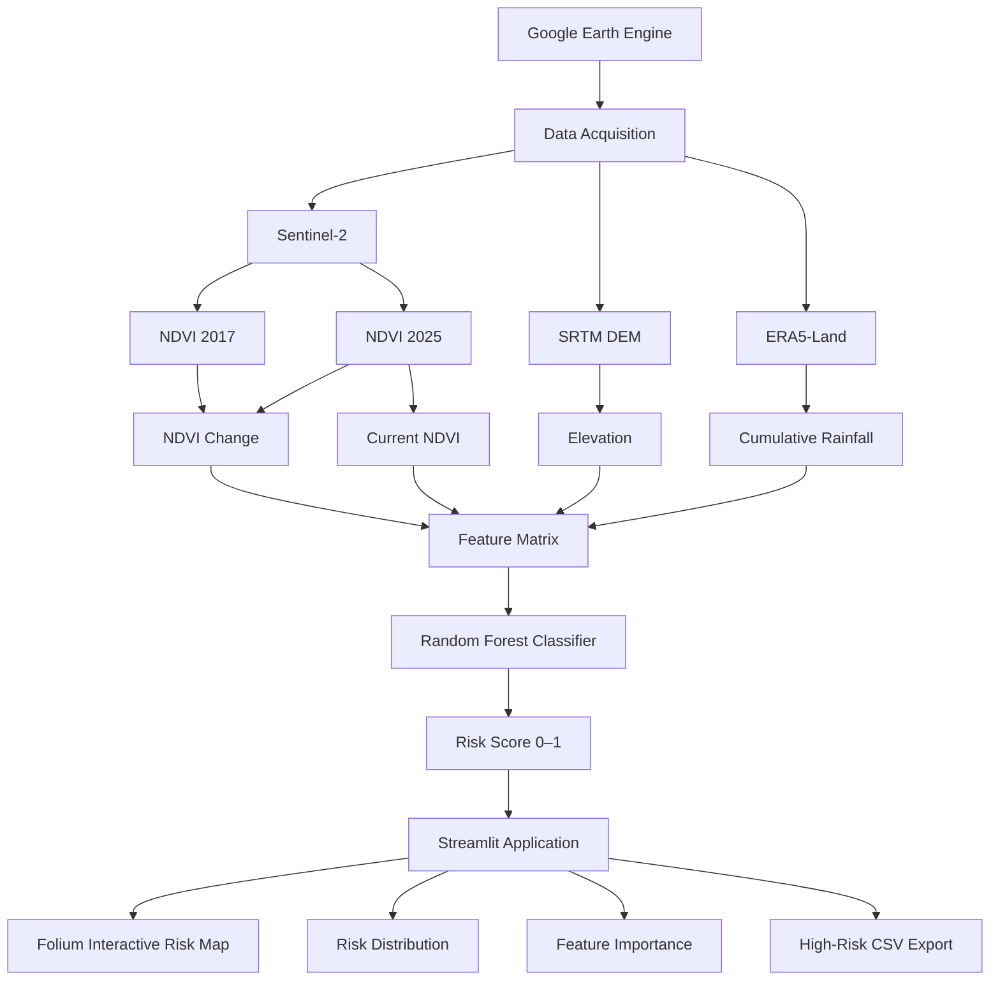

# GeoShield AI — System Architecture

## V1 architecture



## Components

| Layer | Component | Role |
|---|---|---|
| Data | Google Earth Engine | Cloud-side geospatial data access/processing |
| Optical imagery | Sentinel-2 | NDVI and vegetation-change features |
| Terrain | SRTM DEM | Elevation feature |
| Climate | ERA5-Land | Cumulative rainfall feature |
| ML | Random Forest | Spatial risk classification |
| Backend/application | Python | Data processing and inference |
| UI | Streamlit | Interactive application |
| Mapping | Folium | Risk-map visualization |
| Output | CSV | Export of high-risk sampled locations |

## Inference flow

```text
User selects sample count + risk threshold
                    ↓
        Google Earth Engine query
                    ↓
           Feature extraction
                    ↓
             Spatial sampling
                    ↓
         Pandas feature dataframe
                    ↓
          Random Forest inference
                    ↓
          Risk score for each point
                    ↓
       Map + charts + high-risk table
                    ↓
               CSV export
```

## V2 direction

The planned V2 architecture adds:

```text
Sentinel-1 SAR / InSAR
Landsat thermal anomalies
Expanded ground truth
Temporal features
Weather updates
        ↓
Improved validation + model
        ↓
Calibrated risk / uncertainty
        ↓
Trend detection + alerts
```

V2 should be treated as a separate development phase rather than represented as completed functionality in the V1 repository.
